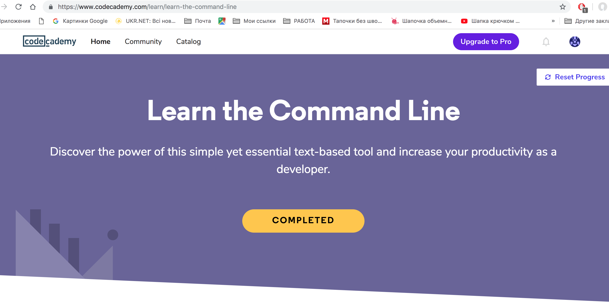
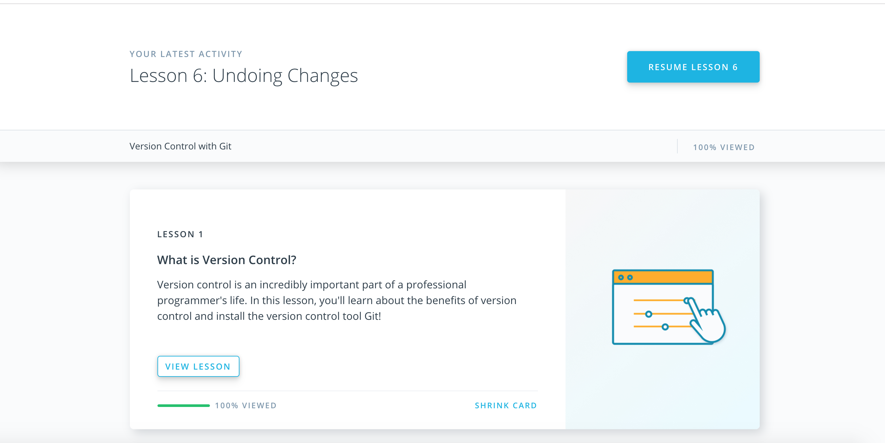
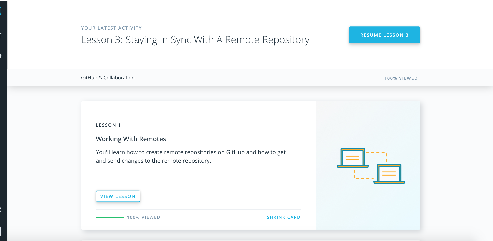
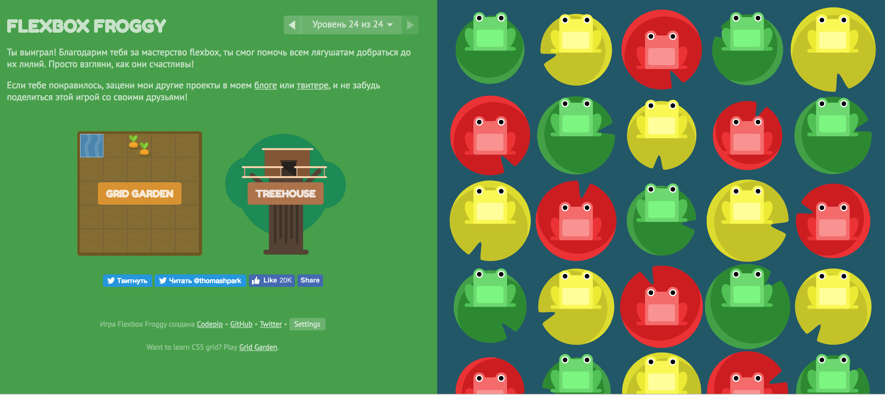
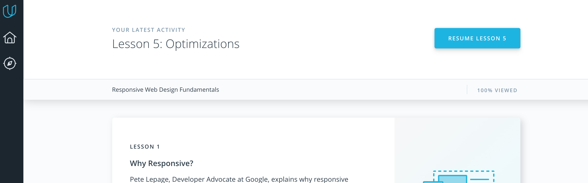

[%3D-mastered%20gitignore-orange.svg)](https://github.com/kottans/kottans/endorsements.md)

# kottans-frontend
repo for having fun=)

## Linux CLI, and HTTP
Its was useful=)

**What was new: **
-How to navigate on command line in files structure 
-How to use a nano editor and create own comand files 
-How to copy,move,delete,create and write (read) files from command line 
-The difference between POST, GET, OPTIONS, DELETE, PUT requests 
-What is the difference on HTTP and HTTPS, and how to set up (remotely understand) HTTPS connection 
-Where I can find information about requests (devtools) 
-How to set headers on request 
-Improve my knowledge about server status codes 

**What was interesting: **

-nano commands 
-server status codes 

**What I will use: **

-all of that=) (hahahahahhahaahhaha) 

## Git Collaboration

**What was new: **
-Git log options)  
-Git merge conflicts and how to resolve them  
-Rebase and cherry-pick  

Its was very interesting courses about GIT, but I feel that need real project for 100% understanding of material).

## Responsive Web Design

I already played flex-froggy, but for training I passed it again=) 
**What was new in Responsive web design: **
-I open new option in chrome devtools
-Do the responsive page from small to large width
