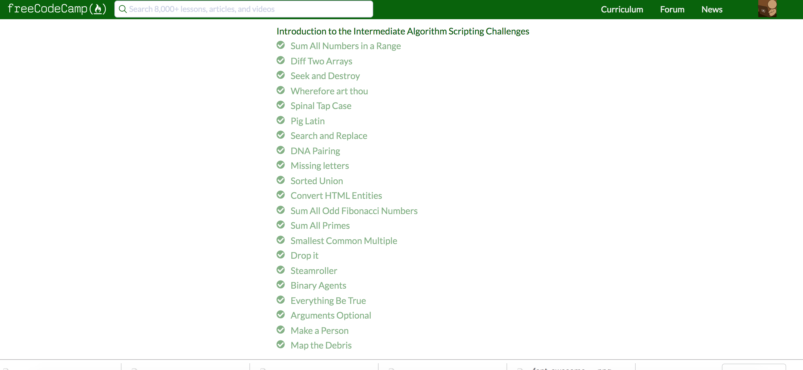
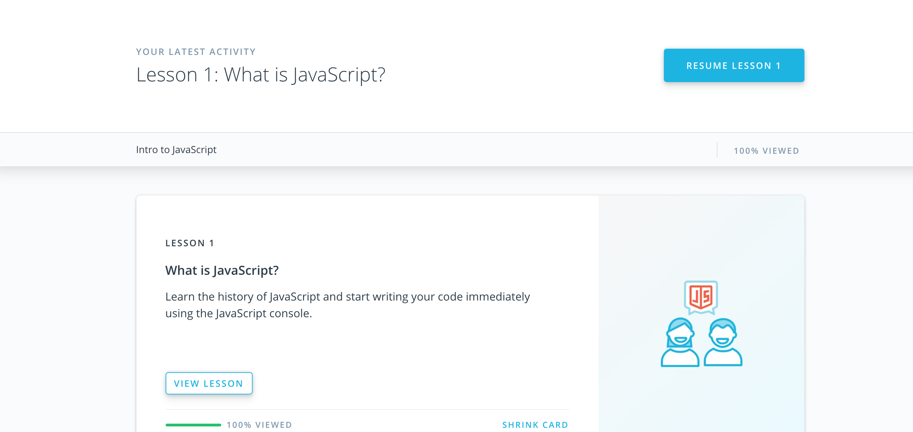
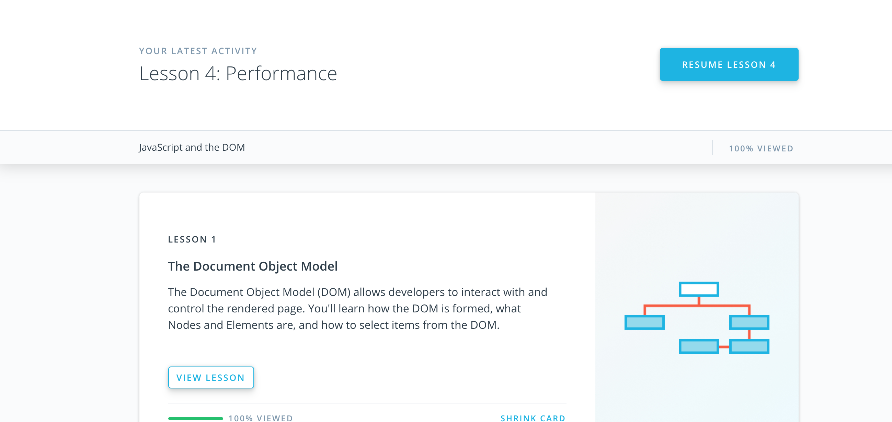
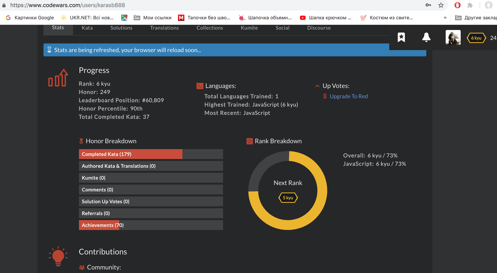

[%3D-mastered%20gitignore-orange.svg)](https://github.com/kottans/kottans/endorsements.md)
[%3D-mastered%20conflict%20resolution-brightgreen.svg)](https://github.com/kottans/kottans/blob/master/endorsements.md)

# kottans-frontend
repo for having fun=)

## Linux CLI, and HTTP
Its was useful=)

**What was new: **
-How to navigate on command line in files structure 
-How to use a nano editor and create own comand files 
-How to copy,move,delete,create and write (read) files from command line 
-The difference between POST, GET, OPTIONS, DELETE, PUT requests 
-What is the difference on HTTP and HTTPS, and how to set up (remotely understand) HTTPS connection 
-Where I can find information about requests (devtools) 
-How to set headers on request 
-Improve my knowledge about server status codes 

**What was interesting: **

-nano commands 
-server status codes 

**What I will use: **

-all of that=) (hahahahahhahaahhaha) 

## Git Collaboration

**What was new: **
-Git log options)  
-Git merge conflicts and how to resolve them  
-Rebase and cherry-pick  

Its was very interesting courses about GIT, but I feel that need real project for 100% understanding of material).

## Responsive Web Design

I already played flex-froggy, but for training I passed it again=) 
**What was new in Responsive web design: **
-I open new option in chrome devtools
-Do the responsive page from small to large width

## JS Basics

**What was interesting: **
-do the exercises (creating algorithms, searching new methods to solve tasks)

**What was new: **
-some methods to work with arrays 
-new methods to work with strings 
-creating object with methods

## DOM

**What was interesting: **

-working with dom and use dom-methods 
-read about js optimization 
-complete last half of freecodecamp course=) 

**What was new: **
-textContent method (a know only about innerHTML) 
-firstElementChild property and parentElement property (before that I use Query \-\_\- ) 
-call stack and how it works 
-performance.now (i know only about console.time) 
-method createDocumentFragment 
-when use setTimeout with delay 0 

https://github.com/Karasb888/docs/tree/master/docs  
Reviewed and approved by @OleksiyRudenko

## A Tiny JS World

https://github.com/Karasb888/a-tiny-JS-world  
Reviewed and approved by @OleksiyRudenko

**What was new: **
-for in loop (I am so sorry!!) 
-how to choose names for constant in js

## Object Oriented JS
Game:

https://karasb888.github.io/frogger-game/  
Reviewed and approved by @OleksiyRudenko

CodeWars:
https://www.codewars.com/users/karasb888

**What was interesting: **
-Do the task on codewars, write algorithms, loops etc 
-Trying to upgrade kyu on codewars=) 
-Building my first OOP app =) 

**What was new: **
-OOP in js) 
-arrays methods (map, find) 
-working with side code (engine in OOP frogger) 

## OOP Exercise

Code Base  
https://github.com/Karasb888/a-tiny-JS-world/blob/gh-pages/index.js  
Demo  
https://karasb888.github.io/a-tiny-JS-world/
 Reviewed and approved by @OleksiyRudenko

**What was interesting: **
-Rebuild own code 
-Improving code to keep him DRY and SOLID (still need practise =( )) 

**What was new: **
-Better understanding OOP in js 
-Extending subclasses in superclass,  

## Memory Pair Game

https://karasb888.github.io/memory-pair-game/
 Reviewed and approved by @zonzujiro

**What was interesting: **
-Listing spongbob memes when searching for image  
-Create my first GAME!=)  
-Using my knowledge in real js project  

**What was new: **
-Some css animation tricks 
-arrays.methods > for loop =) 
